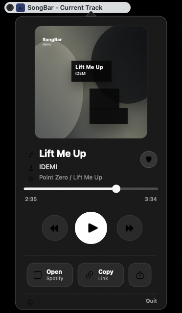

# SongBar

A minimal macOS menu bar now-playing app for Spotify.

SongBar puts the current artist and song title in your menu bar. Click it for a compact panel with album art, a progress slider, playback controls, quick actions, and an optional Liked Songs button.

[](LICENSE)


<p align="center">
  
</p>

## Features

- Album art + artist – song title visible in your menu bar
- Animated equalizer indicator while music plays
- Native popover panel: artwork, progress slider, prev / play / next, share actions
- Optional Spotify login for connected features such as saving the current track to Liked Songs
- Adaptive polling — 1 s while playing, 3 s otherwise — so it stays light on battery
- No Dock icon, no analytics, no telemetry
- Base playback features talk to the **local** Spotify desktop app via Apple Events and do not require Spotify login

## Install

1. Download the latest `SongBar-x.y.z.dmg` from the [Releases](https://github.com/TthBnc/SongBar/releases) page.
2. Open the dmg and drag **SongBar** into your **Applications** folder.
3. Open Applications, **right-click SongBar** and choose **Open**. macOS will warn that the developer can't be verified — that's expected for an unsigned open-source app. Click **Open** to confirm.
4. Look for SongBar in your menu bar — top-right of the screen, near the clock.

> Right-click → Open is only needed once. After that you can launch it normally. This is unsigned because we don't yet have an Apple Developer ID; once we do, the warning will go away.

## First-run permission

The first time SongBar tries to read or control Spotify, macOS will prompt you to grant **Automation** permission so SongBar can talk to the Spotify app. Click **Allow**.

If you accidentally deny, re-enable it in **System Settings → Privacy & Security → Automation**, find SongBar in the list, and toggle Spotify on.

See [`docs/TROUBLESHOOTING.md`](docs/TROUBLESHOOTING.md) if anything goes sideways.

## Requirements

- macOS 14 (Sonoma) or later
- The [Spotify desktop app](https://www.spotify.com/download) installed and signed in

SongBar does not work with the web player or Spotify Connect playback on a remote device — it reads the local desktop app.

## Optional Spotify Login

SongBar's base features work without Spotify login. To save or remove tracks from **Liked Songs**, connect Spotify in **SongBar Settings** with a Spotify Developer Client ID:

1. Open the [Spotify Developer Dashboard](https://developer.spotify.com/dashboard) and create an app.
2. Use any app name and description you want. Select **Web API**.
3. Add this exact redirect URI: `http://127.0.0.1:17654/callback`
4. Save the app, then copy its **Client ID**. You do not need the Client Secret.
5. In SongBar, open **Settings**, paste the Client ID, and click **Connect Spotify**.

Use `127.0.0.1` exactly. Spotify allows HTTP for loopback redirect URIs, but `localhost` is not accepted.

Spotify apps in development mode support up to 5 allowlisted users. Add your Spotify account in the app's **User Management** page before connecting. If you distribute SongBar to other people, they can either use the base features without login or connect with their own Spotify Developer app and Client ID.

## Privacy

- SongBar **doesn't** ask for your Spotify password. It never sees one.
- SongBar **doesn't** send your listening history anywhere. There is no server, no analytics, no telemetry.
- Optional Spotify login uses OAuth PKCE in your browser. SongBar stores the returned tokens in your macOS Keychain.
- Album artwork is downloaded directly from Spotify's CDN to render the panel.
- If you connect Spotify, SongBar also talks directly to Spotify's Web API for connected features such as Liked Songs.

## Build from source

```sh
git clone https://github.com/TthBnc/SongBar.git
cd SongBar
open SongBar.xcodeproj
```

Build and run the `SongBar` scheme in Xcode 16 or later.

To run unit tests from the command line:

```sh
xcodebuild -scheme SongBar -configuration Debug -destination 'platform=macOS' test
```

For details on packaging a `.dmg` (signed or unsigned), see [`CONTRIBUTING.md`](CONTRIBUTING.md#packaging-a-dmg).

## Contributing

Bug reports, ideas, and PRs welcome. See [`CONTRIBUTING.md`](CONTRIBUTING.md).

## License

MIT — see [`LICENSE`](LICENSE).

## Trademark

SongBar is an independent open-source project and is not affiliated with, endorsed by, or sponsored by Spotify. Spotify is a trademark of Spotify AB.
